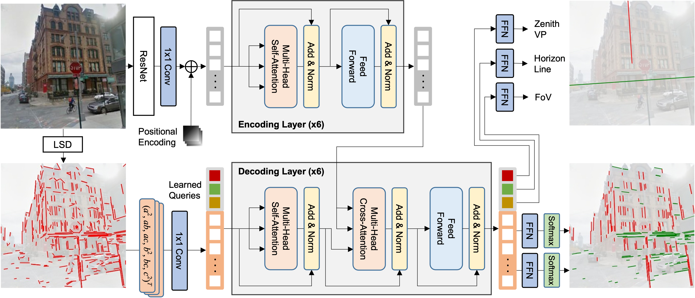

**CTRL-C**: Camera calibration TRansformer with Line-Classification
========
This repository contains the official code and pretrained models for **CTRL-C** (**C**amera calibration **TR**ansformer with **L**ine-**C**lassification). Jinwoo Lee, Hyunsung Go, Hyunjoon Lee, Sunghyun Cho, Minhyuk Sung and Junho Kim.

Single image camera calibration is the task of estimating the camera parameters from a single input image, such as the vanishing points, focal length, and horizon line. In this work, we propose Camera calibration TRansformer with Line-Classification (CTRL-C), an end-to-end neural network-based approach to single image camera calibration, which directly estimates the camera parameters from an image and a set of line segments. Our network adopts the transformer architecture to capture the global structure of an image with multi-modal inputs in an end-to-end manner. We also propose an auxiliary task of line classification to train the network to extract the global geometric information from lines effectively. Our experiments demonstrate that CTRL-C outperforms the previous stateof-the-art methods on the Google Street View and SUN360 benchmark datasets.



## Results & Checkpoints

|Dataset| Up Dir (◦) | Pitch (◦) | Roll (◦) | FoV (◦) | AUC (%) | URL |
| --- | --- | --- | --- | --- | --- | --- |
| Google Street View | 1.80 | 1.58 | 0.66 | 3.59 | 87.29 | [gdrive](https://drive.google.com/file/d/1IqayB2Tk7a6LeTdEuvahX5BJ14q4dgCM/view?usp=sharing) |
| SUN360             | 1.91 | 1.50 | 0.96 | 3.80 | 85.45 | [gdrive](https://drive.google.com/file/d/1FVk9qWk1EJS4OingFadHQa_juxxHNxi4/view?usp=sharing) |

## Preparation

1. Clone this repository

2. Setup environments

   ```
   conda create -n ctrlc python
   conda activate ctrlc
   conda install -c pytorch torchvision
   
   pip install -r requrements.txt
   ```

   

## Training Datasets

* [Google Street View dataset](https://drive.google.com/file/d/1opDR_j-9y4TY82ZscBb-xYAoMkTocAOp/view?usp=sharing)
* [SUN360 dataset](https://vision.cs.princeton.edu/projects/2012/SUN360/data/)
  * You need to preprocess dataset

## Training

* Single GPU

```
python main.py --config-file 'config-files/ctrl-c.yaml' --opts OUTPUT_DIR 'logs'
```

* Multi GPU

```
python -m torch.distributed.launch --nproc_per_node=4 --use_env main.py --config-file 'config-files/ctrl-c.yaml' --opts OUTPUT_DIR 'logs'
```

## Evaluation
```
python test.py --dataset 'GoogleStreetView' --opts OUTPUT_DIR 'outputs'
```


## Acknowledgments

This code is based on the implementations of [**DETR: End-to-End Object Detection with Transformers**](https://github.com/facebookresearch/detr). 